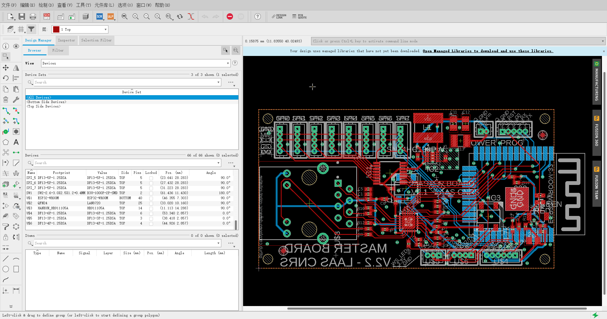

# Autodesk Eagle 导出 Partlist 转换程序
### 运行方式
`python Process.py`

### 存在问题
- 发现 Autodesk Eagle 导出的 Partlist 并不包含 Bottom 等其他非 Top 层的元器件位置
- Top Bottom 信息可以直接在 .brd 文件中查看
- 目前 Layer 信息可通过 `Process_Layer.py` 修改
- 目前 Layer 信息可通过 `Process.py` 直接生成，根据 Rotation 列是 R70 还是 MR70 判断

  

